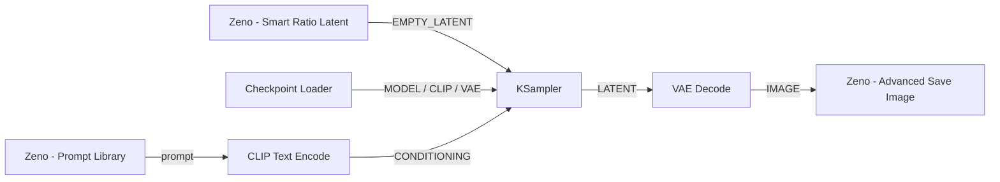

# Zeno-node (ComfyUI Custom Nodes Pack)

[](LICENSE)
[](https://www.python.org/)
[](https://github.com/comfyanonymous/ComfyUI)
[](tests/)

A lightweight, high-performance custom node pack for **ComfyUI** designed to streamline aspect ratio generation, in-workflow prompt management, and automated image saving with complete metadata.

---

## 📦 Nodes Summary

### 1. 🖼️ Zeno - Advanced Save Image (`AdvancedSaveImage`)
*Category: `Zeno/Image`*

Automatically organizes and saves image batches with clean, descriptive filenames:
- **Auto Model Detection:** Scans the execution graph (`PROMPT`) to identify active checkpoints or loader nodes (`CheckpointLoaderSimple`, `UNETLoader`, etc.).
- **Smart Naming & Formatting:** Generates `Model_Timestamp_CustomText.png` with standardized casing (capitalizing only index 0) and sanitized paths/digits.
- **Flexible Subfolders:** Route outputs by Date (`YYYY-MM-DD`), Model Name, or Custom path.
- **Workflow Retention:** Embeds lossless PNGInfo metadata for full drag-and-drop workflow reconstruction.
- **Customizable Audio Notification:** Audio chime upon batch generation completion with 11 distinct selectable sound presets (Chimes, Ding, Notify, Tada, Chord, etc.) and an interactive in-canvas test button.

---

### 2. 📐 Zeno - Smart Ratio Latent Generator (`RatioLatentGenerator`)
*Category: `Zeno/Latent`*

Generates empty latents with guaranteed VAE-safe spatial dimensions:
- **Aspect Ratio Presets:** Supports `1:1`, `5:4`, `4:3`, `3:2`, `16:9`, `21:9`, `2.35:1`, or auto-detection from input image/mask.
- **VAE-Safe Multiples of 32:** Automatically snaps dimensions to multiples of 32 within $[256, 4000]$ px to eliminate VAE spatial mismatches.
- **Orientation Toggle:** Switch between Landscape and Portrait with one click (`swap_dimensions`).
- **Synchronized Image/Mask Transform:** Resizes input `IMAGE` and `MASK` tensors via `stretch`, `crop` (center crop), or `letterbox` (padding).

---

### 3. 📝 Zeno - Prompt Library (`PromptLibrary`)
*Category: `Zeno/Text`*

Stores multiple reusable prompt slots directly inside your workflow:
- **Interactive Canvas UI:** Manage dynamic slots directly on the node with 1-based index badges `[1]`, `[2]`, organizer titles, and multiline textareas.
- **Quick Prompt Switching:** Choose the active prompt slot via a single integer (`selected_index`).
- **Clean Scalar Output:** Outputs the exact selected prompt body as `STRING` with full Unicode/Vietnamese support. Titles remain organizer-only metadata.
- **Defensive Error Handling:** Fails fast on empty prompts or invalid indices to prevent wasted generation runs.

---

## 💡 Workflow Example



---

## 📥 Installation

### Method 1: Git Clone (Recommended)
```bash
cd ComfyUI/custom_nodes
git clone https://github.com/ZenoSigma/Zeno-node.git
pip install -r Zeno-node/requirements.txt
```

### Method 2: ComfyUI Manager
1. Open ComfyUI ➔ **Manager** ➔ **Custom Nodes Manager**.
2. Search for `Zeno-node` (or click **Install via Git URL** and enter `https://github.com/ZenoSigma/Zeno-node.git`).
3. Restart ComfyUI.

---

## 🚀 Repository Structure

```bash
Zeno-node/
├── __init__.py                  # Package entrypoint & node mappings
├── README.md                    # Project overview & documentation
├── AGENTS.md                    # Multi-AI operator guidelines & protocols
├── CLAUDE.md                    # Claude Code CLI instructions
├── .cursorrules                 # Cursor IDE rules
├── pyproject.toml               # Package metadata & ComfyUI registry configuration
├── LICENSE                      # MIT License
├── requirements.txt             # Python dependencies
├── docs/                        # Deep technical specifications
│   ├── architecture.md          # Data pipeline & architecture diagrams
│   ├── api_spec.md              # Complete node API & parameter specifications
│   └── algorithm.md             # VAE snapping math & interpolation algorithms
├── nodes/                       # Core Python backend implementations
│   ├── __init__.py
│   ├── advanced_save_image.py   # AdvancedSaveImage node
│   ├── ratio_latent_node.py     # RatioLatentGenerator node
│   └── prompt_library_node.py   # PromptLibrary node
├── web/                         # ComfyUI frontend web extensions
│   └── js/
│       └── prompt_library.js    # Interactive canvas UI extension
└── tests/                       # Automated unittest suites
    ├── test_naming.py           # Unit tests for image naming & sanitization
    └── test_prompt_library.py   # Unit tests for prompt library validation
```

---

## 🧪 Testing

Run all unit tests locally:
```bash
python -m unittest discover tests
```

---

## 📚 Technical Documentation

- [Architecture & Data Pipeline](docs/architecture.md) — Pipeline diagrams, module separation, execution flows.
- [API & Node Specification](docs/api_spec.md) — Detailed parameter constraints, hidden inputs, and return signatures.
- [Algorithm & Math Principles](docs/algorithm.md) — Snap-to-32 calculations and spatial interpolation transforms.
- [AI Operator Guidelines](AGENTS.md) — Sequential AI onboarding protocol and contribution standards.

---

## 📄 License

This project is licensed under the MIT License - see the [LICENSE](LICENSE) file for details.
