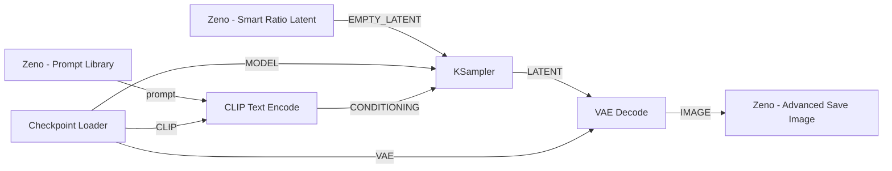

# Zeno-node (ComfyUI Custom Nodes Pack)

[](LICENSE)
[](https://www.python.org/)
[](https://github.com/comfyanonymous/ComfyUI)
[](tests/)

A high-performance custom node pack for **ComfyUI** designed to optimize aspect ratio generation, streamline prompt management, and organize image output with rich metadata.

---

## 📦 Nodes Overview

| Node Name | Class Name | Category | Purpose |
| :--- | :--- | :--- | :--- |
| **`Zeno - Advanced Save Image`** | `AdvancedSaveImage` | `Zeno/Image` | Auto model-detected naming, smart timestamping, subfolder routing, lossless PNGInfo metadata, and audio notification. |
| **`Zeno - Smart Ratio Latent Generator`** | `RatioLatentGenerator` | `Zeno/Latent` | VAE-safe latent sizing (multiples of 32) with integrated image/mask cropping, letterboxing, and stretching. |
| **`Zeno - Prompt Library`** | `PromptLibrary` | `Zeno/Text` | Reusable in-workflow prompt library with an interactive canvas UI, organizer titles, and one-based index switching. |

---

## 🛠️ Detailed Node Documentation

### 1. 🖼️ Zeno - Advanced Save Image
Saves image batches with a standardized, descriptive filename hierarchy: `Model_Timestamp_CustomText.png`.

- **Auto Model Detection:** Scans the execution graph (`PROMPT` dict) to identify active checkpoints or switch nodes (`CheckpointLoaderSimple`, `UNETLoader`, `CheckpointSwitch`, etc.).
- **Filename Sanitization:** Strips directory paths, numeric weights, file extensions, and special characters; enforces clean casing (capitalizing only index 0).
- **Subfolder Grouping:** Organizes output by Date (`YYYY-MM-DD`), Model Name, or a Custom directory path.
- **Workflow Metadata:** Losslessly embeds graph JSON and UI state into PNGInfo for seamless drag-and-drop workflow reloading.
- **Completion Chime:** Optional audio chime on completion (`play_sound_on_finish`).

#### Inputs & Outputs
| Type | Name | Data Type | Default | Description |
| :--- | :--- | :--- | :--- | :--- |
| **Input** | `images` | `IMAGE` | *(required)* | PyTorch image tensor batch `[B, H, W, C]` |
| **Input** | `include_model_name` | `BOOLEAN` | `True` | Prepend auto-detected model name |
| **Input** | `include_timestamp` | `BOOLEAN` | `True` | Append timestamp |
| **Input** | `timestamp_format` | `COMBO` | `%Y%m%d_%H%M%S` | Pattern string (`%Y%m%d_%H%M%S`, `%Y-%m-%d_%H-%M-%S`, `%Y%m%d`, `%H%M%S`) |
| **Input** | `custom_text` | `STRING` | `""` | Optional tag, concept, or notes |
| **Input** | `subfolder_mode` | `COMBO` | `"None"` | Subfolder grouping mode (`None`, `By Date`, `By Model Name`, `Custom Subfolder`) |
| **Input** | `custom_subfolder` | `STRING` | `""` | Subfolder path (used when mode is `Custom Subfolder`) |
| **Input** | `save_workflow_metadata` | `BOOLEAN` | `True` | Embed prompt and workflow JSON in PNG |
| **Input** | `play_sound_on_finish` | `BOOLEAN` | `False` | Play completion audio alert |
| **Output** | `images` | `IMAGE` | — | Passthrough image tensor batch |
| **Output** | `file_paths` | `STRING` | — | Newline-separated absolute file paths saved on disk |

---

### 2. 📐 Zeno - Smart Ratio Latent Generator
Generates standard aspect ratio empty latents while enforcing VAE-safe spatial dimensions (multiples of 32) between 256 and 4000 pixels.

- **Standard Ratios:** `1:1`, `5:4`, `4:3`, `3:2`, `16:9`, `21:9`, `2.35:1`, or auto-detect from input image/mask.
- **Orientation Toggle:** `swap_dimensions` instantly switches between Landscape and Portrait.
- **Synchronized Transform Pipeline:** Transforms input `IMAGE` and `MASK` using `stretch`, `crop` (center crop), or `letterbox` (zero padding) with PyTorch interpolation algorithms (`bicubic`, `bilinear`, `nearest`, `area`).

#### Inputs & Outputs
| Type | Name | Data Type | Default | Description |
| :--- | :--- | :--- | :--- | :--- |
| **Input** | `longest_side` | `INT` | `1024` | Target length for the longest edge (`[1024, 4000]`, step 32) |
| **Input** | `aspect_ratio` | `COMBO` | `"1:1"` | Aspect ratio preset |
| **Input** | `swap_dimensions` | `BOOLEAN` | `False` | Swap width and height for portrait/landscape switch |
| **Input** | `batch_size` | `INT` | `1` | Number of empty latent samples (`[1, 64]`) |
| **Input** | `crop_mode` | `COMBO` | `"letterbox"` | Transform mode for optional image/mask (`letterbox`, `crop`, `stretch`) |
| **Input** | `method` | `COMBO` | `"bicubic"` | PyTorch interpolation algorithm (`bicubic`, `bilinear`, `nearest`, `area`) |
| **Input (opt)** | `image` | `IMAGE` | `None` | Optional image to transform to calculated dimensions |
| **Input (opt)** | `mask` | `MASK` | `None` | Optional mask to transform to calculated dimensions |
| **Output** | `WIDTH` | `INT` | — | Calculated width (guaranteed multiple of 32) |
| **Output** | `HEIGHT` | `INT` | — | Calculated height (guaranteed multiple of 32) |
| **Output** | `EMPTY_LATENT` | `LATENT` | — | Latent dictionary `{"samples": Tensor [B, 4, H // 8, W // 8], "downscale_ratio_spacial": 8}` |
| **Output** | `IMAGE` | `IMAGE` | — | Transformed image tensor `[B, H, W, C]` (or black canvas if not supplied) |
| **Output** | `MASK` | `MASK` | — | Transformed mask tensor `[B, H, W]` (or zero mask if not supplied) |

---

### 3. 📝 Zeno - Prompt Library
Stores multiple prompt slots with organizer titles inside the workflow and outputs the selected prompt string.

- **Embedded Workflow Storage:** Saves all prompt slots directly in workflow metadata.
- **Interactive Canvas UI:** Dynamic rows with 1-based index badges `[1]`, `[2]`, title inputs, multiline prompt textareas, and Add/Remove controls.
- **One-Based Index Selection:** Switch between stored prompts simply by changing the `selected_index` integer.
- **Defensive Error Handling:** Rejects out-of-bounds indices and empty prompts with actionable errors. Titles are strictly isolated and never leak into the output prompt.

#### UI Overview
```text
Prompt number: [ 2 ]

[1] [Portrait          ] [portrait photo, soft light ...        ] [Remove]
[2] [Landscape         ] [mountain landscape, sunrise ...       ] [Remove]

                                               [+ Add slot]
```

#### Inputs & Outputs
| Type | Name | Data Type | Default | Description |
| :--- | :--- | :--- | :--- | :--- |
| **Input** | `selected_index` | `INT` | `1` | One-based slot number (Prompt number) to output (`min: 1`) |
| **Hidden** | `slots_json` | `STRING` | `[...]` | Hidden JSON state synchronized with the frontend UI |
| **Output** | `prompt` | `STRING` | — | The exact prompt text stored in the selected slot |

---

## 💡 Workflow Connection Example



---

## 📥 Installation

### Method 1: Git Clone (Recommended)
```bash
cd ComfyUI/custom_nodes
git clone https://github.com/ZenoSigma/Zeno-node.git
pip install -r Zeno-node/requirements.txt
```

### Method 2: ComfyUI Manager
1. Open ComfyUI.
2. Open **Manager** ➔ **Custom Nodes Manager**.
3. Search for `Zeno-node` (or click **Install via Git URL** and enter `https://github.com/ZenoSigma/Zeno-node.git`).
4. Restart ComfyUI.

---

## 🚀 Repository Structure

```bash
Zeno-node/
├── __init__.py                  # Root package export & ComfyUI node mappings
├── README.md                    # Project documentation & usage guide
├── AGENTS.md                    # Multi-AI operator guidelines & protocols
├── CLAUDE.md                    # Claude Code instructions
├── .cursorrules                 # Cursor IDE rules
├── pyproject.toml               # Package metadata & ComfyUI publisher configuration
├── LICENSE                      # MIT License
├── requirements.txt             # Python dependencies (torch, torchvision, numpy, Pillow)
├── docs/
│   ├── architecture.md          # Architecture & data pipeline specs
│   ├── api_spec.md              # Full API parameter & output contract
│   └── algorithm.md             # Snapping math & spatial interpolation formulas
├── nodes/
│   ├── __init__.py
│   ├── advanced_save_image.py   # AdvancedSaveImage implementation
│   ├── prompt_library_node.py   # PromptLibrary implementation
│   └── ratio_latent_node.py     # RatioLatentGenerator implementation
├── web/
│   └── js/
│       └── prompt_library.js    # Interactive frontend canvas widget extension
└── tests/
    ├── test_naming.py           # Unit tests for save image naming & sanitization
    └── test_prompt_library.py   # Unit tests for prompt library validation & JSON state
```

---

## 🧪 Testing

Run all unit test suites locally:
```bash
python -m unittest discover tests
```

---

## 📚 Technical Documentation & AI Guidelines

- [Architecture & Data Pipeline](docs/architecture.md) — Architectural diagrams, module separation, execution flows.
- [API & Node Specification](docs/api_spec.md) — Parameter constraints, hidden inputs, and return signatures.
- [Algorithm & Math Principles](docs/algorithm.md) — Snap-to-32 calculations and spatial interpolation transforms.
- [AI Operator Guidelines](AGENTS.md) — Sequential AI onboarding protocol and contribution standards.


---

## 📄 License

This project is licensed under the MIT License - see the [LICENSE](LICENSE) file for details.
