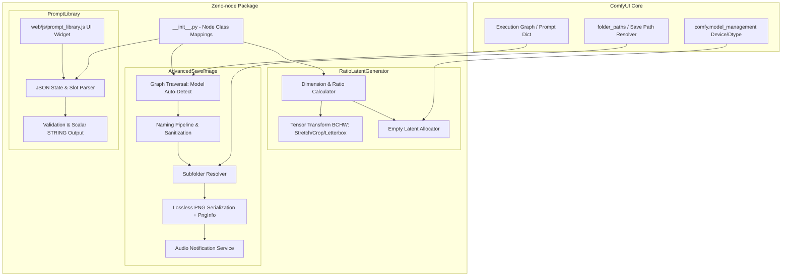

# Architecture & Data Pipeline Specification

This document details the architectural design, module layout, and data pipeline of **Zeno-node** within the ComfyUI ecosystem.

---

## 1. 🏗️ System Overview & High-Level Architecture

Zeno-node is a modular custom node pack designed for high-performance ComfyUI workflows. It interfaces directly with ComfyUI's execution engine, PyTorch tensor pipelines, and filesystem primitives.

---

## 2. 🧩 Layer Separation & Module Roles

| Layer | Files | Responsibilities |
| :--- | :--- | :--- |
| **Node Registration** | `__init__.py`, `nodes/__init__.py` | Exports `NODE_CLASS_MAPPINGS`, `NODE_DISPLAY_NAME_MAPPINGS`, and `WEB_DIRECTORY` to ComfyUI node registry. |
| **Frontend UI Extension** | `web/js/prompt_library.js` | Interactive slot management widget for ComfyUI canvas, title/prompt fields, dynamic row addition/removal, and workflow JSON synchronization. |
| **Prompt Storage & Selection** | `nodes/prompt_library_node.py` | Parses slot JSON array, validates index and prompt content, and emits the selected prompt as a scalar `STRING`. |
| **Latent Generation & Transforms** | `nodes/ratio_latent_node.py` | Calculates dimensions with VAE-safe rounding (multiples of 32), creates empty latents, and performs tensor transformations (stretch, center crop, letterbox padding). |
| **Image Saving & Metadata** | `nodes/advanced_save_image.py` | Inspects execution graph, extracts model names, builds sanitized hierarchical filenames, resolves subfolders, preserves workflow metadata in PNGInfo, and plays completion alert. |
| **Verification & Tests** | `tests/test_naming.py`, `tests/test_prompt_library.py` | Unittest suites verifying graph inspection, filename sanitization, casing normalization, JSON slot parsing, boundary validation, and Unicode preservation. |

---

## 3. 🔄 Data Pipelines

### A. Prompt Library Pipeline
1. **Frontend Interaction:** User edits title/prompt slots or modifies slot count in the node UI.
2. **Hidden Serialization:** JavaScript extension serializes slot objects into `slots_json`.
3. **Index Selection:** Node takes 1-based `selected_index` integer.
4. **Execution Validation:** Backend parses JSON, verifies index bounds ($1 \le \text{index} \le N$), asserts prompt is non-empty, and outputs the exact prompt text (`STRING`).

### B. Latent & Image Transformation Pipeline
1. **Aspect Ratio & Boundary Resolution:** Reads requested aspect ratio (or auto-detects from input image/mask). Snaps the longest dimension to the nearest multiple of 32 (`round(dim / 32) * 32`) bounded between `[256, 4000]`.
2. **Complementary Dimension Calculation:** Computes secondary dimension and snaps to multiple of 32.
3. **Empty Latent Allocation:** Allocates PyTorch FloatTensor on `intermediate_device()` with shape `[B, 4, H // 8, W // 8]`.
4. **Image & Mask Transformation:**
   - Permutes `IMAGE` from `[B, H, W, C]` to PyTorch standard `[B, C, H, W]`.
   - Permutes/unsqueezes `MASK` to `[B, 1, H, W]`.
   - Executes spatial interpolation (`stretch`, `crop`, or `letterbox`).
   - Restores tensors to standard ComfyUI shapes.

### C. Image Saving & Metadata Pipeline
1. **Graph Inspection:** Scans `PROMPT` dictionary recursively across loader and switch nodes to identify model/checkpoint name.
2. **Sanitization:** Removes directory paths, file extensions, numeric digits (for model text), and special characters; applies case normalization (capitalizing only the first character).
3. **Filename Composition:** Concatenates `Model_Timestamp_CustomText`.
4. **Subfolder Resolution:** Formats subfolder by Date (`YYYY-MM-DD`), Model Name, or Custom string.
5. **PNG Encoding:** Saves image as 8-bit RGB lossless PNG with compressed PNGInfo containing workflow and prompt metadata.
6. **Alert Notification:** Invokes platform audio alert upon batch completion.

